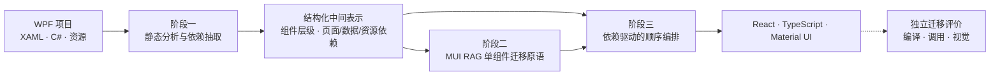

<div align="center">

# WPF2React

**当前版本：Opus 5.0**

**面向 WPF→React/MUI 的依赖驱动多 Agent 前端 UI 迁移方法**

研究范围：XAML 界面结构、C# 数据与交互契约、资源依赖、组件映射及页面级迁移。


</div>

WPF2React 研究 WPF/XAML 到 React/TypeScript/MUI 的跨框架迁移问题。方法通过静态分析恢复工程级依赖，以 MUI 检索增强单组件生成，再按依赖关系编排资源、数据、组件与页面迁移。

## 研究方法视角与两阶段工程落点

当前工程仍采用“阶段一解析器 → 阶段二迁移系统”的两阶段流水线。为明确论文方法中的职责，下面把迁移系统进一步拆分为“单组件迁移原语”和“完整迁移编排”两个研究环节；这不是新增一套运行流水线。

| 方法环节 | 代码入口 | 方法内容 | 主要产物 |
| --- | --- | --- | --- |
| **阶段一 · 静态分析与依赖抽取** | [`src/parser/`](src/parser/README.md) | 对 XAML、C# 与资源执行确定性静态解析，构建稳定源码身份、组件层级、页面/数据/资源依赖及迁移顺序 | `outputs/<project>/` 中的 AST、控件树与依赖图 |
| **阶段二 · 基于 MUI RAG 的单组件迁移** | [`MUISelectAgent`](src/migration/mui_select_agent.py) · [`ComponentMigrateAgent`](src/migration/component_migrate_agent.py) | 将组件作为最小迁移单元，通过 MUI 语义检索定位目标组件，并在知识约束下生成 React/TypeScript 实现 | 组件候选、检索证据与组件级 TSX |
| **阶段三 · 依赖驱动的完整迁移与顺序编排** | [`MigrationOrchestrator`](src/migration/migration_orchestrator.py) · [`PageMigrateAgent`](src/migration/page_migrate_agent.py) · [`PageAssemblyAgent`](src/migration/page_assembly_agent.py) | 按资源 → C# → 数据 → 页面组织工程迁移，在页面内自底向上调用阶段二原语，并以七轮渐进组装形成最终页面 | `results/<project>/` 中的 React/TypeScript 与静态资源 |



阶段二定义“单个组件如何迁移”，阶段三负责“这些原语如何按依赖关系组成完整工程”。[只读迁移评价](src/migration/evaluation/README.md)用于测量最终结果，不计入三阶段方法本身。

## 最小复现

已验证环境为 Python 3.11。将待迁移项目放入 `repos/<project>/`：

```bash
/opt/homebrew/bin/python3.11 -m venv .venv
.venv/bin/python -m pip install -r requirements-local.lock
cp .env.example .env

# 阶段一：静态分析与依赖抽取
.venv/bin/python -m src.parser ExpenseItDemo

# 阶段二、三：当前 CLI 在完整编排中调用单组件迁移原语
.venv/bin/python -m src.migration ExpenseItDemo

# 正式数据集：用同一冻结 page ID 集合约束迁移与后续对比
.venv/bin/python scripts/build_experiment_page_set.py
.venv/bin/python -m src.migration Prism \
  --output-base-dir outputs/parser-completeness/after-run-2 \
  --page-set docs/research/experiment-page-set-v2.json

# 独立评价：构建待核验清单并运行工程评价
.venv/bin/python -m src.migration.evaluation build-manifest ExpenseItDemo \
  --target-root results/ExpenseItDemo \
  --output outputs/ExpenseItDemo/evaluation_manifest.json
.venv/bin/python -m src.migration.evaluation run \
  outputs/ExpenseItDemo/evaluation_manifest.json \
  --method-id MigraUI --run-id seed-1 \
  --output-dir outputs/evaluation/MigraUI/seed-1
```

正式评价前须人工核验并冻结 GT 清单；视觉评价入口见[迁移评价文档](src/migration/evaluation/README.md)。运行记录追加到 `logs/`。迁移会向 `.env` 配置的模型端点发送源码上下文，请先确认数据披露范围与调用成本。

> 当前迁移器输出 React/TypeScript 源码与静态资源，不生成完整工程骨架。目标项目仍需提供 `package.json`、TypeScript 配置与应用入口。

## 文档导航

| 主题 | 入口 |
| --- | --- |
| 使用 | [输入项目约定](repos/README.md) · [Parser](src/parser/README.md) · [迁移编排](src/migration/README.md) |
| 验证 | [冻结实验页面集合](docs/research/experiment-page-set.md) · [迁移 baseline](src/migration/baselines/README.md) · [迁移评价](src/migration/evaluation/README.md) · [评价指标](docs/guides/evaluation-metrics.md) · [本地基线](docs/guides/local-baseline.md) |
| 设计 | [MigraUI 研究方法](docs/research/02_前端UI迁移研究稿.md) · [仓库架构](docs/guides/repository-architecture.md) · [Agent 基础设施](src/agents/README.md) · [LLM 基础设施](src/llm/README.md) · [公共基础设施](src/common/README.md) |
| 全部资料 | [文档索引](docs/README.md) |
