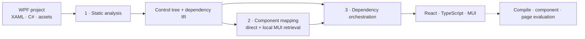

<div align="center">


<br />

[**English**](./README.md) · [简体中文](./README.zh-CN.md)

<br />


**Migrate application structure and behavior—not just XAML tags.**

Static dependency recovery · local MUI retrieval · bottom-up component migration · project-level orchestration

</div>

> [!NOTE]
> This portfolio snapshot highlights the completed full-pipeline experiment on **mvvmlight, MvvmCross, and Login-In-WPF-MVVM-C-Sharp-and-SQL-Server**. Visual before/after screenshots can be added later; the generated code and compile evaluation are shown here as the current reproducible evidence.

## Why WPF2React

A UI migration is a dependency problem disguised as a markup conversion problem. Pages depend on resources, view models, custom controls, navigation edges, and platform behavior. WPF2React first recovers those contracts, then migrates them in a dependency-safe order to React, TypeScript, and Material UI.

| Capability | What it contributes |
| --- | --- |
| **Deterministic static analysis** | Parses XAML, C#, control trees, resources, data, and page dependencies into repository-relative intermediate artifacts. |
| **Hybrid component mapping** | Maps standard WPF controls directly and retrieves version-aware local MUI knowledge for custom or ambiguous controls. |
| **Bottom-up migration** | Migrates leaf controls before parent components, then assembles complete pages with the recovered hierarchy and bindings. |
| **Project orchestration** | Orders resources → C# → data → pages and preserves exact page identities across generation and evaluation. |

## Results at a glance

All three full experiments finished successfully: **9/9 pages** and **45/45 components** were generated, with no failed page migrations. The read-only evaluator matched and compiled **41/45 components (91.1%)** and compiled **9/9 pages (100%)**; unmatched components were recorded separately rather than counted as compile failures.

| Project | Pages generated | Components generated | Evaluator matched + compiled | Page compile rate |
| --- | ---: | ---: | ---: | ---: |
| mvvmlight | 1 / 1 | 2 / 2 | 1 / 2 | 100% |
| MvvmCross | 5 / 5 | 18 / 18 | 18 / 18 | 100% |
| Login MVVM | 3 / 3 | 25 / 25 | 22 / 25 | 100% |
| **Total** | **9 / 9** | **45 / 45** | **41 / 45** | **100%** |

The experiment used a frozen page set, isolated parser output per run, `gpt-5.6-luna`, and **205,751 total tokens** across 118 logical model calls. See the [experiment page set](docs/research/experiment-page-set.md) and [evaluation contract](src/migration/evaluation/README.md) for scope and metric definitions.

## Migration showcase

The following excerpt comes from the Login MVVM experiment. It demonstrates how WPF bindings, a custom password control, commands, gradients, and interaction styles are translated into React state, event handlers, and MUI `sx` rules.

<details open>
<summary><strong>Before · WPF / XAML</strong></summary>

```xml
<StackPanel Width="220" Grid.Row="1" Margin="0,35,0,0">
  <TextBox
      Text="{Binding Username, UpdateSourceTrigger=PropertyChanged}"
      Foreground="White"
      BorderThickness="0,0,0,2"
      Padding="20,0,0,0">
    <TextBox.Background>
      <ImageBrush ImageSource="/Images/user-icon.png" AlignmentX="Left" />
    </TextBox.Background>
  </TextBox>

  <customcontrols:BindablePasswordBox
      Password="{Binding Password, Mode=TwoWay,
                 UpdateSourceTrigger=PropertyChanged}" />

  <Button Command="{Binding LoginCommand}" Content="LOG IN">
    <Button.Style>
      <Style TargetType="Button">
        <Setter Property="Background" Value="#462AD8" />
        <Style.Triggers>
          <Trigger Property="IsMouseOver" Value="True">
            <Setter Property="Background" Value="#28AEED" />
          </Trigger>
        </Style.Triggers>
      </Style>
    </Button.Style>
  </Button>
</StackPanel>
```

</details>

<details open>
<summary><strong>After · React + TypeScript + MUI</strong></summary>

```tsx
const [username, setUsername] = useState('');
const [password, setPassword] = useState('');

const handleUsernameChange = (value: string) => setUsername(value);
const handlePasswordChange = (value: string) => setPassword(value);

<Stack sx={{ width: 220, justifySelf: 'center', mt: '35px' }}>
  <TextField
    value={username}
    onChange={(event) => handleUsernameChange(event.target.value)}
    variant="standard"
    sx={{
      '& .MuiInputBase-root': {
        color: 'white',
        pl: '20px',
        backgroundImage: 'url(/Images/user-icon.png)',
        backgroundRepeat: 'no-repeat',
        backgroundPosition: 'left center',
      },
    }}
  />

  <TextField
    type="password"
    value={password}
    onChange={(event) => handlePasswordChange(event.target.value)}
    variant="standard"
  />

  <Button
    onClick={handleLogin}
    sx={{
      mt: '30px',
      borderRadius: '20px',
      backgroundColor: '#462AD8',
      '&:hover': { backgroundColor: '#28AEED' },
    }}
  >
    LOG IN
  </Button>
</Stack>
```

</details>

| Preserved contract | WPF source | React target |
| --- | --- | --- |
| Layout hierarchy | `Grid`, `StackPanel`, rows/columns | MUI `Box` / `Stack`, CSS grid and flex |
| Two-way input | `Binding` + `UpdateSourceTrigger` | typed state + `onChange` |
| Visual states | `Style.Triggers` | MUI `sx` pseudo-selectors |
| Custom control | `BindablePasswordBox` | retrieved MUI `TextField` password implementation |
| Assets and theming | `ImageBrush`, gradient brushes | CSS backgrounds, gradients, and copied static assets |

## Method



| Stage | Primary entry point | Main artifact |
| --- | --- | --- |
| 1 · Static analysis | [`src.parser`](src/parser/README.md) | XAML/C# models, control trees, and dependency graphs in `outputs/<project>/` |
| 2 · Component migration | [`MUISelectAgent`](src/migration/mui_select_agent.py) + [`ComponentMigrateAgent`](src/migration/component_migrate_agent.py) | Component mapping evidence and TSX fragments |
| 3 · Project migration | [`MigrationOrchestrator`](src/migration/migration_orchestrator.py) + page agents | React/TypeScript source and static assets in `results/<project>/` |
| Evaluate | [`src.migration.evaluation`](src/migration/evaluation/README.md) | Component, page, call-edge, and visual evaluation records |

## Quick start

Requirements: Python 3.11 and an LLM endpoint configured in `.env`.

```bash
python3.11 -m venv .venv
.venv/bin/python -m pip install -r requirements.txt
cp .env.example .env
```

Place a WPF project in `repos/<project>/`, then run:

```bash
.venv/bin/python -m src.parser ExpenseItDemo
.venv/bin/python -m src.migration ExpenseItDemo
```

<details>
<summary><strong>Run the frozen experiment page set</strong></summary>

```bash
.venv/bin/python scripts/build_experiment_page_set.py

.venv/bin/python scripts/run_migration_experiment.py \
  --run-id <run-id> \
  --parser-output-base-dir outputs/parser-completeness/current \
  --project <project>
```

Each experimental project receives isolated parser artifacts, generated application scaffolding, a run manifest, a migration summary, and an evaluation manifest.

</details>

Build and execute a read-only evaluation manifest:

```bash
.venv/bin/python -m src.migration.evaluation build-manifest ExpenseItDemo \
  --target-root results/ExpenseItDemo \
  --output outputs/ExpenseItDemo/evaluation_manifest.json

.venv/bin/python -m src.migration.evaluation run \
  outputs/ExpenseItDemo/evaluation_manifest.json \
  --method-id MigraUI --run-id seed-1 \
  --output-dir outputs/evaluation/MigraUI/seed-1
```

> [!IMPORTANT]
> Migration sends source context to the model endpoint configured in `.env`. Confirm repository visibility, disclosure policy, and expected cost before running it.

## Current evaluation boundary

- The three-repository run validates generation and TypeScript compilation; its call-edge tests were not configured, so it does not claim end-to-end behavioral equivalence.
- Visual evaluation is supported by the evaluator, but before/after screenshots have not yet been frozen for this run. The code comparison above is the current showcase evidence.
- The default migrator emits source and static assets, not a standalone application scaffold. The experiment runner adds an isolated Vite/TypeScript scaffold for compile evaluation.

## Repository map

| Path | Purpose |
| --- | --- |
| [`src/parser/`](src/parser/README.md) | WPF/XAML/C# parsing and dependency recovery |
| [`src/migration/`](src/migration/README.md) | Component agents, page assembly, and orchestration |
| [`src/migration/baselines/`](src/migration/baselines/README.md) | Migration baselines |
| [`src/migration/evaluation/`](src/migration/evaluation/README.md) | Read-only compile, component, page, call, and visual metrics |
| [`docs/research/experiment-page-set.md`](docs/research/experiment-page-set.md) | Frozen experiment scope |
| [`docs/`](docs/README.md) | Research method, guides, and architecture |

## Validation

```bash
.venv/bin/python -m unittest discover -s tests -t . -v
.venv/bin/python scripts/check_shared_infrastructure.py --other ../CodeIdiomMine
```

<div align="center">

An inspectable path from **desktop UI contracts** to **modern web components**.

</div>
