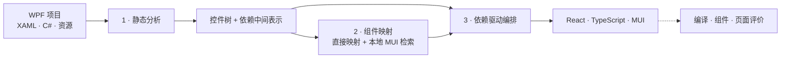

<div align="center">



<br />

[English](./README.md) · [**简体中文**](./README.zh-CN.md)

<br />


**迁移应用结构与行为，而不只是转换 XAML 标签。**

静态依赖恢复 · 本地 MUI 检索 · 自底向上组件迁移 · 项目级编排

</div>

> [!NOTE]
> 本招牌项目首页聚焦已完成全流程的三个项目：**mvvmlight、MvvmCross 与 Login-In-WPF-MVVM-C-Sharp-and-SQL-Server**。页面迁移前后截图可在后续补充；当前以生成代码和编译评价作为可复现证据。

## 为什么是 WPF2React

UI 迁移表面是标记转换，本质是依赖问题。页面依赖资源、ViewModel、自建控件、导航关系和平台行为。WPF2React 先恢复这些契约，再按照依赖安全的顺序迁移到 React、TypeScript 和 Material UI。

| 能力 | 价值 |
| --- | --- |
| **确定性静态分析** | 将 XAML、C#、控件树、资源、数据和页面依赖解析为使用仓库相对路径标识的中间产物。 |
| **混合组件映射** | 对标准 WPF 控件直接映射；对自建或歧义控件检索带版本信息的本地 MUI 知识。 |
| **自底向上迁移** | 先迁移叶子控件，再按照恢复出的层级与绑定组装父组件和完整页面。 |
| **项目级编排** | 按资源 → C# → 数据 → 页面执行，并在生成和评价阶段保持精确页面身份。 |

## 核心结果

三个全量实验均成功完成：生成 **9/9 个页面**和 **45/45 个组件**，没有页面迁移失败。只读评价器自动匹配并编译 **41/45 个组件（91.1%）**，并成功编译 **9/9 个页面（100%）**；未匹配组件被单独记录，不会被混入编译失败。

| 项目 | 生成页面 | 生成组件 | 评价器匹配并编译 | 页面编译率 |
| --- | ---: | ---: | ---: | ---: |
| mvvmlight | 1 / 1 | 2 / 2 | 1 / 2 | 100% |
| MvvmCross | 5 / 5 | 18 / 18 | 18 / 18 | 100% |
| Login MVVM | 3 / 3 | 25 / 25 | 22 / 25 | 100% |
| **合计** | **9 / 9** | **45 / 45** | **41 / 45** | **100%** |

实验使用冻结页面集合、每次运行隔离的 Parser 产物、`gpt-5.6-luna`，共执行 118 次逻辑模型调用，消耗 **205,751 token**。实验范围与指标定义见[实验页面集合](docs/research/experiment-page-set.md)和[评价合同](src/migration/evaluation/README.md)。

## 迁移前后展示

以下片段来自 Login MVVM 实验，展示 WPF 绑定、自建密码控件、命令、渐变与交互样式如何迁移为 React state、事件处理器和 MUI `sx` 规则。

<details open>
<summary><strong>迁移前 · WPF / XAML</strong></summary>

```xml
<StackPanel Width="220" Grid.Row="1" Margin="0,35,0,0">
  <TextBox
      Text="{Binding Username, UpdateSourceTrigger=PropertyChanged}"
      Foreground="White"
      BorderThickness="0,0,0,2"
      Padding="20,0,0,0">
    <TextBox.Background>
      <ImageBrush ImageSource="/Images/user-icon.png" AlignmentX="Left" />
    </TextBox.Background>
  </TextBox>

  <customcontrols:BindablePasswordBox
      Password="{Binding Password, Mode=TwoWay,
                 UpdateSourceTrigger=PropertyChanged}" />

  <Button Command="{Binding LoginCommand}" Content="LOG IN">
    <Button.Style>
      <Style TargetType="Button">
        <Setter Property="Background" Value="#462AD8" />
        <Style.Triggers>
          <Trigger Property="IsMouseOver" Value="True">
            <Setter Property="Background" Value="#28AEED" />
          </Trigger>
        </Style.Triggers>
      </Style>
    </Button.Style>
  </Button>
</StackPanel>
```

</details>

<details open>
<summary><strong>迁移后 · React + TypeScript + MUI</strong></summary>

```tsx
const [username, setUsername] = useState('');
const [password, setPassword] = useState('');

const handleUsernameChange = (value: string) => setUsername(value);
const handlePasswordChange = (value: string) => setPassword(value);

<Stack sx={{ width: 220, justifySelf: 'center', mt: '35px' }}>
  <TextField
    value={username}
    onChange={(event) => handleUsernameChange(event.target.value)}
    variant="standard"
    sx={{
      '& .MuiInputBase-root': {
        color: 'white',
        pl: '20px',
        backgroundImage: 'url(/Images/user-icon.png)',
        backgroundRepeat: 'no-repeat',
        backgroundPosition: 'left center',
      },
    }}
  />

  <TextField
    type="password"
    value={password}
    onChange={(event) => handlePasswordChange(event.target.value)}
    variant="standard"
  />

  <Button
    onClick={handleLogin}
    sx={{
      mt: '30px',
      borderRadius: '20px',
      backgroundColor: '#462AD8',
      '&:hover': { backgroundColor: '#28AEED' },
    }}
  >
    LOG IN
  </Button>
</Stack>
```

</details>

| 保留的契约 | WPF 源端 | React 目标端 |
| --- | --- | --- |
| 布局层级 | `Grid`、`StackPanel`、行列定义 | MUI `Box` / `Stack`、CSS grid 与 flex |
| 双向输入 | `Binding` + `UpdateSourceTrigger` | 类型化 state + `onChange` |
| 视觉状态 | `Style.Triggers` | MUI `sx` 伪选择器 |
| 自建控件 | `BindablePasswordBox` | 检索得到的 MUI `TextField` 密码输入实现 |
| 资源与主题 | `ImageBrush`、渐变画刷 | CSS 背景、渐变与复制后的静态资源 |

## 方法流程



| 阶段 | 主要入口 | 核心产物 |
| --- | --- | --- |
| 1 · 静态分析 | [`src.parser`](src/parser/README.md) | `outputs/<project>/` 中的 XAML/C# 模型、控件树与依赖图 |
| 2 · 组件迁移 | [`MUISelectAgent`](src/migration/mui_select_agent.py) + [`ComponentMigrateAgent`](src/migration/component_migrate_agent.py) | 组件映射证据与 TSX 片段 |
| 3 · 项目迁移 | [`MigrationOrchestrator`](src/migration/migration_orchestrator.py) + 页面 Agent | `results/<project>/` 中的 React/TypeScript 源码与静态资源 |
| 评价 | [`src.migration.evaluation`](src/migration/evaluation/README.md) | 组件、页面、调用边与视觉评价记录 |

## 快速开始

环境要求：Python 3.11，以及在 `.env` 中配置的 LLM 端点。

```bash
python3.11 -m venv .venv
.venv/bin/python -m pip install -r requirements.txt
cp .env.example .env
```

将 WPF 项目放入 `repos/<project>/`，然后运行：

```bash
.venv/bin/python -m src.parser ExpenseItDemo
.venv/bin/python -m src.migration ExpenseItDemo
```

<details>
<summary><strong>运行冻结实验页面集合</strong></summary>

```bash
.venv/bin/python scripts/build_experiment_page_set.py

.venv/bin/python scripts/run_migration_experiment.py \
  --run-id <run-id> \
  --parser-output-base-dir outputs/parser-completeness/current \
  --project <project>
```

每个实验项目都会获得相互隔离的 Parser 产物、生成的应用脚手架、运行清单、迁移摘要与评价清单。

</details>

构建并执行只读评价清单：

```bash
.venv/bin/python -m src.migration.evaluation build-manifest ExpenseItDemo \
  --target-root results/ExpenseItDemo \
  --output outputs/ExpenseItDemo/evaluation_manifest.json

.venv/bin/python -m src.migration.evaluation run \
  outputs/ExpenseItDemo/evaluation_manifest.json \
  --method-id MigraUI --run-id seed-1 \
  --output-dir outputs/evaluation/MigraUI/seed-1
```

> [!IMPORTANT]
> 迁移过程会向 `.env` 中配置的模型端点发送源码上下文。运行前请确认仓库公开性、数据披露规则和预期调用成本。

## 当前评价边界

- 三仓实验已验证代码生成与 TypeScript 编译；调用边测试尚未配置，因此不宣称端到端行为等价。
- 评价器已支持视觉评价，但本轮尚未冻结迁移前后截图；上方代码对比是当前首页展示证据。
- 默认迁移器只输出源码和静态资源，不输出独立应用脚手架；实验运行器会为编译评价增加隔离的 Vite/TypeScript 脚手架。

## 仓库导航

| 路径 | 作用 |
| --- | --- |
| [`src/parser/`](src/parser/README.md) | WPF/XAML/C# 解析与依赖恢复 |
| [`src/migration/`](src/migration/README.md) | 组件 Agent、页面组装与完整编排 |
| [`src/migration/baselines/`](src/migration/baselines/README.md) | 迁移 baseline |
| [`src/migration/evaluation/`](src/migration/evaluation/README.md) | 只读编译、组件、页面、调用与视觉指标 |
| [`docs/research/experiment-page-set.md`](docs/research/experiment-page-set.md) | 冻结实验范围 |
| [`docs/`](docs/README.md) | 研究方法、指南与架构 |

## 验证

```bash
.venv/bin/python -m unittest discover -s tests -t . -v
.venv/bin/python scripts/check_shared_infrastructure.py --other ../CodeIdiomMine
```

<div align="center">

一条从**桌面 UI 契约**走向**现代 Web 组件**的可审计路径。

</div>
