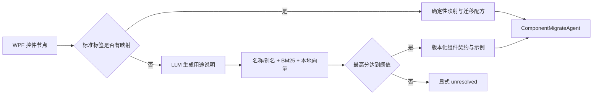

# 组件知识库设计与验证

对应版本：Opus 5.1

本文说明迁移阶段如何为标准 WPF 控件和自建控件选择 MUI 实现，以及为什么当前项目采用“确定性映射注册表 + 版本化结构化目录 + 混合检索”，而不是单独使用数据库表、纯向量 RAG 或 LLM Wiki。

## 方案结论

三种候选方式解决的问题并不相同：

| 方式 | 适合解决 | 主要不足 | 本项目定位 |
| --- | --- | --- | --- |
| 数据库或表格映射 | 标准控件的一对一或配方映射，可审计且确定 | 无法泛化到名称和实现未知的自建控件 | 标准控件主路径 |
| RAG | 根据名称、属性、binding、事件和用途搜索相近组件 | 单独使用会让已知标准控件产生不必要的不确定性 | 自建控件主路径 |
| LLM Wiki | 汇总文档、生成别名和辅助维护 | 在线直接决策难以复现，容易混入错误版本或虚构 API | 仅作为离线维护工具，不是运行时事实源 |

因此不引入独立数据库服务或重型向量数据库。当前知识库只有几十个目标组件，Git 版本化 JSON 足以完成审查、差异比较和复现；本地 BM25 与向量计算也不需要额外基础设施。

## 优化前实现及问题

原实现已经具备“直接映射优先、未知控件语义检索”的基本框架，但存在五个影响迁移质量的问题：

1. `wpf_to_mui_mapping.json` 只覆盖 47 个基础控件中的 35 个；`Image`、`Frame`、`GridSplitter`、`DatePicker` 等仍会进入概率检索。
2. `mui_components.json` 只有英文说明与示例，没有目标版本、别名、允许 import 和配方约束。目标是 MUI 5.18.0，但语料中存在不属于该目标依赖的条目。
3. 未知控件只按名称相似度与英文描述向量各占一半排序，没有关键词稀疏检索、置信度或未解析状态；无候选时还会静默回退到 `Box`。
4. LLM 只看到截断为 1000 字符的源码，没有结构化属性与 binding、command、event 等语义引用。
5. Parser 的 `controls` 树只保留基础控件；自建控件虽进入 `custom_controls` 清单，却不会被 `PageMigrateAgent` 访问。因此单独提高检索质量仍无法改善完整页面迁移。

## 当前知识层次



各文件职责如下：

| 文件 | 职责 |
| --- | --- |
| `rags/mui/wpf_to_mui_mapping.json` | 既有标准 WPF→MUI 映射 |
| `rags/mui/wpf_mapping_overrides.json` | 补齐缺失基础控件，并保存目标版本可执行配方 |
| `rags/mui/mui_components.json` | 第三方原始组件说明和示例语料 |
| `rags/mui/component_catalog.json` | 项目自有的目标版本、中文摘要、别名、关键词、允许 import、约束与排除条目 |
| `src/migration/component_knowledge.py` | 合并语料、计算 BM25、渲染版本化提示词上下文 |
| `src/migration/mui_select_agent.py` | 执行确定性映射或混合召回，返回策略、置信度和候选分数 |

结构化目录固定目标 React 18.2.0、MUI 5.18.0 和 TypeScript 5.9.3。`NumberField` 与 `Masonry` 因不符合目标依赖被排除；`Progress`、`RadioButton`、`FloatingActionButton` 和 `TransferList` 明确标为配方名，并登记实际允许的 MUI import，避免生成不存在的包导出。

## 自建控件检索

自建控件查询包含以下证据：

- 标签名及驼峰拆词；
- XAML 属性；
- Parser 提取的 binding、command、event 等 `semantic_references`；
- 最多 4000 字符的控件源码；
- 低档 LLM 生成的一到两句中文用途说明。

候选分数由名称/别名相似度、BM25 和 `all-MiniLM-L6-v2` 本地向量相似度融合。向量模型强制 `local_files_only=True`，运行时不会隐式下载或联网。最高分低于阈值时返回 `unresolved`，不再伪装成 `Box` 成功。

响应同时保存：

- `retrieval_strategy`：`deterministic_mapping`、`hybrid_rag` 或 `unresolved`；
- `confidence`：最高候选融合分数；
- `candidate_scores`：与候选顺序对齐的分数；
- `query_description`：LLM 生成的标准化用途说明。

这些字段使后续 Recall@K、MRR、置信度校准和错误分析不必从日志反推。

## Parser 与冻结评测兼容

控件依赖产物保留两棵树：

- `controls` / `control_count`：仍只包含基础控件，继续作为冻结实验的既有组件分母；
- `migration_controls` / `migration_control_count`：包含基础控件和可视自建控件，供新迁移运行使用。

行为、转换器、命令、ViewModel、Trigger、Transition 等非可视自建对象不会进入迁移树；资源子树仍不参与逐控件迁移。`PageMigrateAgent` 优先读取新树，旧 Parser 产物则自动回退到 `controls`。这项兼容层不会原地改变 `wpf-page-set-v2` 的 688 个基础控件实例分母。

## 验证与停止条件

本轮预先采用以下停止条件：

- 47 个标准基础控件全部具有确定性映射；
- 自建控件离线 Recall@3 为 1.00，MRR 不低于 0.80；
- 3 个未登记名称的合成自建控件经真实低档模型完成召回与迁移；
- 生成代码不使用 MUI `<Grid>`、不存在的本地模块或伪 `@mui/material/Progress`，并通过目标版本 TypeScript 严格编译。

2026-08-01 的结果如下：

| 验证 | 结果 |
| --- | --- |
| 标准控件映射覆盖 | 47/47 |
| 已登记自建控件离线集 | Recall@3=1.00，MRR=1.00 |
| 未登记名称语义留出集 | Recall@3=1.00，MRR=1.00 |
| 真实 Luna 召回 | 3/3 Top-1，3 次 provider 调用 |
| 真实 Luna 召回后迁移 | 3/3 通过，6 次 provider 调用 |
| 生成 TSX 严格编译 | 3/3 通过，TypeScript 5.9.3 + MUI 5.18.0 |

结果已经超过停止条件，因此不继续增加重排 Agent、在线 LLM 评审或向量数据库。上述样本只证明知识库机制和小规模合成迁移有效，不等于正式 73 页实验的组件准确率、页面编译率、调用通过率或视觉保真度。

## 复现命令

离线知识库与 Parser 合同：

```bash
.venv/bin/python -m unittest tests.migration.test_component_knowledge -v
.venv/bin/python -m unittest tests.parser.test_dataset_parser_regressions.XamlSemanticTests -v
```

真实模型 smoke 会发送合成 XAML 到 `.env` 配置的模型端点，运行前须确认调用成本与披露范围：

```bash
.venv/bin/python -m tests.migration.test_mui_select_smoke
.venv/bin/python -m tests.migration.test_custom_component_smoke
```

真实生成结果保存在忽略目录 `outputs/component-knowledge-smoke/`，不作为提交内容或正式实验结果。
