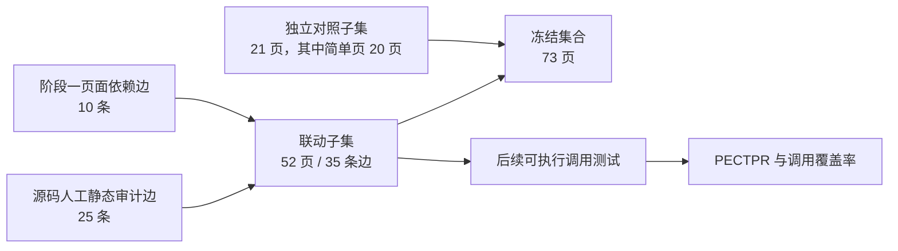

# WPF 迁移实验冻结页面集合

当前冻结版本：`wpf-page-set-v2`。冻结日期：2026-08-01。初始的 `wpf-page-set-v1` 保留用于版本追溯。

## 1. 结论

基于阶段一对 20 个正式项目、754 个页面的完整解析结果，当前主实验冻结为 **20 个项目、73 个页面、688 个控件实例、35 条集合内页面调用边**。其中 52 页至少参与一条集合内调用边；21 页为独立迁移样本，其中 20 页不超过 10 个控件。联动页占 71.23%，仍是数据集主体；简单独立页用于单独判断页面结构和组件迁移能力。

冻结的机器可读输入是 [`experiment-page-set-v2.json`](experiment-page-set-v2.json)。v2 以 [`experiment-page-set-v1.json`](experiment-page-set-v1.json) 为基础，只登记新增页面、复核理由和新增人工边；加载时得到完整自包含页集。运行 `scripts/build_experiment_page_set.py` 后，阶段一指标、解析器边、边界边和固定 commit 会展开到被 Git 忽略的 `results/dataset/experiment-page-set-v2.json`。

v2 在 v1 基础上新增 19 页、90 个控件实例和 2 条调用边。19 个新增页均不超过 10 个控件，合计只有 4 个 unsupported 节点。本次筛选只使用阶段一产物与固定提交源码，没有读取任何迁移结果或评测分数，因此不会按模型结果事后挑选“成功页面”。

## 2. 筛选方法

筛选单位依次为“正式项目 → 候选页面组 → 页面”。“控件少”只是候选条件，不自动代表适合迁移；最终必须同时通过结构完整性和逻辑边界复核。

1. **固定候选域。** 只从 20 个正式项目和阶段一成功解析的 754 页中选择；只使用阶段一产物与固定提交源码，不查看迁移结果和评测分数。
2. **先执行硬排除。** 排除空壳、加载或错误占位页，主体交互尚未实现的页面，以及主要内容依赖未解析动态宿主的页面。v1 保留页继续采用 40 控件上限；v2 新增页要求 `control_count ≤ 10` 且 `unsupported_node_count ≤ 1`。
3. **要求结构完整。** 页面必须具有可见主体、稳定布局和完整的主要操作；单独的样式资源、无内容窗口壳、只用于承载外部浏览器或平台控件的宿主不进入扩充集。
4. **要求逻辑边界清晰。** 输入、输出、绑定、命令或事件必须能从 XAML 和固定源码解释。允许后端服务存在，但页面主要 UI 不得依赖无法界定的认证、网络、协议、数据库或平台执行流程。
5. **要求目标可映射。** 主体控件和交互应能映射到 React/MUI；无法迁移的 Windows 能力只能作为明确隔离的边界，不能成为页面主体。
6. **兼顾联动和独立页。** 已有关联组继续保留；新增独立页占整个页集不超过 30%。定义 `control_count ≤ 10` 且在冻结调用图中度数为 0 的页面为“简单独立页”。独立页没有调用边，因此不进入 PECTPR 的边分母。
7. **保证项目和概念覆盖。** 每个正式项目至少保留 1 页；Gallery 只增加少量成对概念页，不以重复页面扩大项目权重。WPF-Samples 与 wpfui 的 DatePicker、PasswordBox 形成跨控件库对照。
8. **保存可复核证据。** 页面边必须来自阶段一结果或登记了文件、行号和片段的固定源码；不能仅凭“属于同一项目”判定联动。
9. **禁止结果泄漏。** 冻结前不读取迁移产物、编译结果、视觉分数或 LLM 评测结果；筛选依据只来自输入结构与源码可解释性。

阶段一仍应在完整项目上下文中运行，因为资源、C#、数据和页面关系可能跨越未选页面。正式指标的分母从阶段一产物中投影到冻结页集；不得把 73 个 XAML 文件孤立复制出来重新解析。

代表性排除项说明了为什么不能只按控件数机械筛选：

| 排除页面 | 控件数 | 排除原因 |
| --- | ---: | --- |
| Playnite `EmptyParent`、`ErrorLoading` | 各 2 | 状态占位内容，不是完整功能页面。 |
| EarTrumpet `DialogWindow` | 6 | 主体由动态 `ContentControl` 注入，单独迁移无法确定页面内容。 |
| 1Remote `PasswordInput` | 6 | 涉及二次验证、反射调用和双输入同步，属于逻辑伪简单页。 |
| LLPlayer `WordPopup` | 7 | code-behind 达 454 行，词典查询和交互状态明显超过简单页面范围。 |
| VisualHFT `LoadingAnimationSmall` | 3 | 阶段一识别出 87 个 unsupported 节点，低控件数不能代表可迁移。 |
| TumblThree `AuthenticateView` | 1 | 页面主体依赖外部认证流程，本地 UI 信息不足。 |

应用规则后，18/20 个项目仍形成至少一个联动页面组，共覆盖 52 页；21 页为独立页，其中 20 页满足简单独立页定义，另 1 页是含 27 个控件的 wpfui `ButtonPage`。独立页用于校准页面自身迁移，联动页用于评价跨页面结构和调用恢复。

## 3. 可直接计算的输入指标

| 指标 | 数值 |
| --- | ---: |
| 正式项目覆盖 | 20/20 |
| 冻结页面 | 73/754（9.68%） |
| 参与集合内调用边的页面 | 52（71.23%） |
| 独立页面 | 21（28.77%） |
| 其中简单独立页（不超过 10 个控件） | 20 |
| 含联动页面组的项目 | 18/20 |
| 控件实例 | 688 |
| 单页控件数最小值 / 中位数 / 均值 / 最大值 | 1 / 6 / 9.42 / 40 |
| 1～10 控件页面 | 54 |
| 11～20 控件页面 | 9 |
| 21～30 控件页面 | 6 |
| 31～40 控件页面 | 4 |
| 自定义控件引用 | 177 |
| 阶段一标记的 unsupported 节点 | 151 |
| 集合内页面边 | 35 |
| 阶段一直接解析边 / 人工静态审计边 | 10 / 25 |
| 高置信边 / 中置信边 | 29 / 6 |
| 阶段一直接识别的集合外出边 | 1 |

根类型分布为：`Window` 19、`UserControl` 24、`Page` 16、`MvxWpfView` 5、`ExWindow` 4、`WindowBase` 2、`MetroWindow` 1、`Border` 1、`Button` 1。

| 版本 | 页面 | 控件 | 联动页 | 简单独立页 | 页面边 |
| --- | ---: | ---: | ---: | ---: | ---: |
| v1 | 54 | 598 | 50 | 3 | 33 |
| v2 | 73 | 688 | 52 | 20 | 35 |
| 增量 | +19 | +90 | +2 | +17 | +2 |

| 实验角色 | 项目 | 页面 | 控件 | 页面边 |
| --- | ---: | ---: | ---: | ---: |
| 主业务集 | 5 | 17 | 182 | 9 |
| 压力集 | 7 | 25 | 327 | 11 |
| 平台专项 | 2 | 8 | 73 | 4 |
| 框架导航专项 | 2 | 9 | 30 | 6 |
| 组件映射专项 | 2 | 12 | 66 | 5 |
| 低复杂度 sanity | 2 | 2 | 10 | 0 |

## 4. 逐项目冻结结果

表中页面使用短名展示；唯一身份始终以 JSON 中完整的仓库相对 POSIX page ID 为准。

| 项目 | 角色 | 冻结页面组 | 页 / 控件 / 边 | 选择与边界 |
| --- | --- | --- | ---: | --- |
| mvvmlight | 低复杂度 sanity | `MainPage` | 1 / 2 / 0 | 唯一页面，历史 MVVM 最低复杂度验证。 |
| MvvmCross | 框架导航专项 | `RootView → ModalView → NestedModalView`；`RootView → ChildView → SecondChildView` | 5 / 18 / 4 | 覆盖模态和栈导航两条短链；动态 Window 分支后置。 |
| Prism | 框架导航专项 | `MainWindow → ViewA → NotificationDialog`；`ConfirmationDialog` | 4 / 12 / 2 | 保留 Region/DialogService 链，并加入独立确认对话框。 |
| Login-In-WPF-MVVM-C-Sharp-and-SQL-Server | 主业务集 | `LoginView → BindablePasswordBox`；`LoginView → MainView` | 3 / 25 / 2 | 项目全部页面构成认证业务闭环。 |
| LLPlayer | 压力集 | `SettingsAudio → SelectLanguageDialog`；`ErrorDialog` | 3 / 56 / 1 | 增加完整错误展示闭环；复杂 WordPopup 和设置枢纽排除。 |
| Accelerider.Windows | 主业务集 | `MessageList → MessageCard`；`SearchBar`；`ToolBarButton` | 4 / 20 / 1 | 真实消息组合加两个边界清楚的复用控件。 |
| ScreenToGif | 压力集 | 原四页上传子图；`TextDialog`；`GoTo` | 6 / 61 / 3 | 增加两个闭合对话框；超大 Editor 后置。 |
| Playnite | 压力集 | 原三页插件子图；`LicenseAgreementWindow` | 4 / 68 / 2 | 增加许可接受/拒绝闭环；占位设置页排除。 |
| Flow.Launcher | 主业务集 | 原三页主窗口子图；`InstalledPluginDisplayKeyword` | 4 / 58 / 2 | 增加绑定和命令清楚的插件设置控件。 |
| EarTrumpet | 平台专项 | 原三页音频模板链；ColorTool `MainWindow` | 4 / 41 / 2 | 增加完整颜色工具页；动态内容窗口壳排除。 |
| 1Remote | 压力集 | `NoteIcon → NoteDisplayAndEditor` | 2 / 23 / 1 | 无新增合格简单页；PasswordInput 含安全验证和反射逻辑。 |
| VisualHFT | 压力集 | `Dashboard → TriggerSettingsView`；`UserSettings` | 3 / 40 / 1 | 增加层级设置树，不引入实时行情后端。 |
| snoopwpf | 低复杂度 sanity | `BlogLogoWindow` | 1 / 8 / 0 | 三个 Logo 窗口近乎重复，只留启动页。 |
| OpenGptChat | 主业务集 | `AppWindow → MainPage → ChatPage`；`MainPage → ChatSessionConfigDialog` | 4 / 50 / 3 | 启动、会话缓存和配置弹窗；86 控件 ConfigPage 后置。 |
| ModernFlyouts | 平台专项 | 原三页设置链；`AboutPage` | 4 / 32 / 2 | 增加静态展示与链接页，商店 URI 作为平台边界。 |
| ILSpy | 压力集 | 原三页选项组合；`CreateListDialog` | 4 / 27 / 2 | 增加带非空校验的命名对话框。 |
| WPF-Samples | 组件映射专项 | 原三页；`DatePickerPage`；`PasswordBoxPage` | 5 / 23 / 1 | 增加两个基础组件页，与 wpfui 成对比较。 |
| wpfui | 组件映射专项 | 原五页；`DatePickerPage`；`PasswordBoxPage` | 7 / 43 / 4 | 保留循环导航并增加两个配对组件页。 |
| NETworkManager | 压力集 | `StatusWindow → NetworkConnectionWidgetView`；`IPAddressDialog` | 3 / 52 / 1 | 增加纯前端 IPv4 校验对话框，不执行网络操作。 |
| TumblThree | 主业务集 | `ShellWindow → QueueView` | 2 / 29 / 1 | 无新增合格简单页；认证薄壳和复杂详情页排除。 |

## 5. 从解析到评价的统一实验合同

| 环节 | 冻结页集的用法 | 仍需完整项目上下文的内容 |
| --- | --- | --- |
| 阶段一解析 | 完整解析后，只对 73 页报告页面、控件和关系指标 | XAML/C# 发现、资源闭包、数据依赖、页面图构建 |
| MigraUI 主方法 | `--page-set` 只调度当前项目的冻结 page ID | 项目级资源、C# 和数据迁移仍按现有编排运行 |
| 三条 baseline | 三种方法读取同一 `--page-set`，保持页面分母一致 | 原始项目文件和各方法允许的上下文保持各自合同 |
| 工程可用性评价 | 评测清单只包含冻结页面，并合并 25 条人工审计边 | 编译器、调用测试与目标工程骨架 |
| 视觉评价 | 只为冻结页面登记同状态 WPF/React 截图对 | 截图状态、视口、主题和数据必须人工固定 |

调用图已经可以作为 GT 候选，但 35 条边目前还没有逐条登记 `test_file` 或 `test_command`。因此现在可以计算页面边数量、来源和置信度；在可执行交互测试补齐前，PECTPR 应保持“不可用”，不能把静态存在性当作调用通过。

## 6. 当前进度与下一步

- 已完成：20 个项目阶段一完整解析、v1 关联组筛选、v2 简单页扩充、逐页源码复核、冻结 page ID、页面调用图、输入复杂度统计，以及迁移器、三条 baseline、评测清单构建器对 `--page-set` 的统一接入。
- 已验证：73 页均存在于阶段一依赖图，688 个控件均可进入 schema 2.0 评测清单；35 条集合内边端点全部有效；19 个新增页全部满足扩充阈值，迁移调度对 20 个项目都能按原依赖顺序筛出相同页面集合。
- 尚未执行：基于该冻结页集的正式真实 LLM 全量迁移、三条 baseline 正式运行、目标 React 工程编译、35 条调用边的可执行测试和视觉截图评分。
- 建议顺序：先用 Prism、Login、ScreenToGif 各跑一个关联组校准调用成本和失败模式，再按实验角色逐项目扩展；正式汇总使用仓库内指标、仓库宏平均和角色宏平均，页面微平均只作补充。

若冻结集合再次变化，必须提升 `selection_id`，重新生成展开结果，并为所有对比方法使用同一新版本；不得在看到迁移结果后原地替换页面。v1 只用于版本追溯，后续正式实验默认使用 v2。
